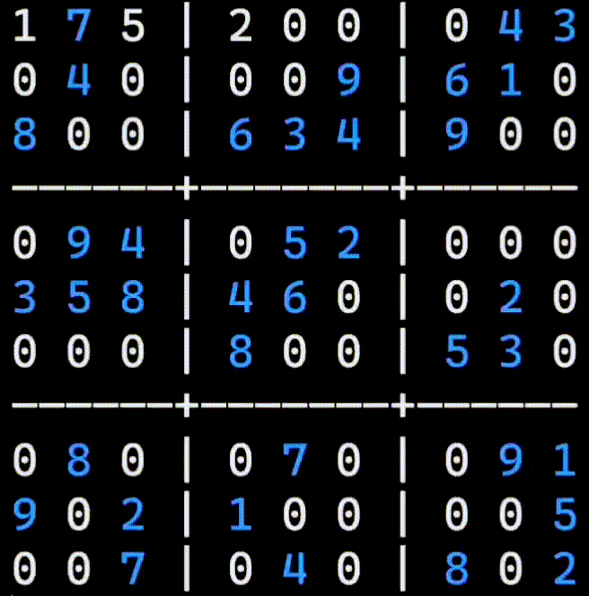

# sudoku_solver_CLI_visualization
 A sudoku solver that prints the work of it in the terminal

## Helpful information
 Run ```main.py``` to see an example, or edit the code to solve your board.
 
 

 (Blue digits are initial ones.)
 
 The solver works by backpropagation, testing every 'solution' until it finds 'the solution'.
 
 Implementation of the structure ```Bitset``` was found on the Internet, all contributes preserved.